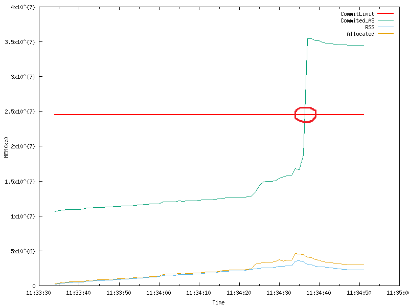

# NSO Memory Utilization Measurement Tool
This is a tool to plot live RSS(Physical Memory Utilization) and Memory Allocated for JavaVM, PythonVMs and NSO Core for NSO. The purpose of this tool is to gain a higher level overview on how memory usage developed during various of incident. Eventually help out Customer to understand what is actually happend in their enviorment, CX on troubleshooting and BU on understanding and fix the problem. 

## Dependency
Gnuplot
```
apt-get install gnuplot
```

## Usage
Start measurment and input measurment time period. The diagram will generated afterwards in the graphs folder per process after the data collection
```
sh plot.sh <Time Consumption>
```


## Data Collection Source
* The Memory Allocated is taking the value in "writeable/private" from pmap command.(Suggestion from Magnus Thoang from Architect Support Team). This gives us the actually allocated memory for each process without shared memory. 
* The Physical Memory Used is from "VmRSS" in "/proc/$pid/status"


## Example Usage
Customer has configured the following settings to only allow 50 percent of total memory to get allocated in the system. 
```
# cat /proc/sys/vm/overcommit_ratio
50
# cat /proc/sys/vm/overcommit_memory
2
```
While NSO require much more than that during the startup. In the diagram below we can clearly see Memory allocated has cross the CommitLimit which triggeres a OOM Crash. 


The memory consumption diagram from ncs.smp shows the allocated memory has not significant spike during the time allocated memory spiked. This can show the issue is because some other process. For example a cron process lunched something exactly at that time. 


## Copyright and License Notice
```
Copyright (c) 2025 Cisco and/or its affiliates.

This software is licensed to you under the terms of the Cisco Sample
Code License, Version 1.1 (the "License"). You may obtain a copy of the
License at

               https://developer.cisco.com/docs/licenses

All use of the material herein must be in accordance with the terms of
the License. All rights not expressly granted by the License are
reserved. Unless required by applicable law or agreed to separately in
writing, software distributed under the License is distributed on an "AS
IS" BASIS, WITHOUT WARRANTIES OR CONDITIONS OF ANY KIND, either express
or implied.
```

